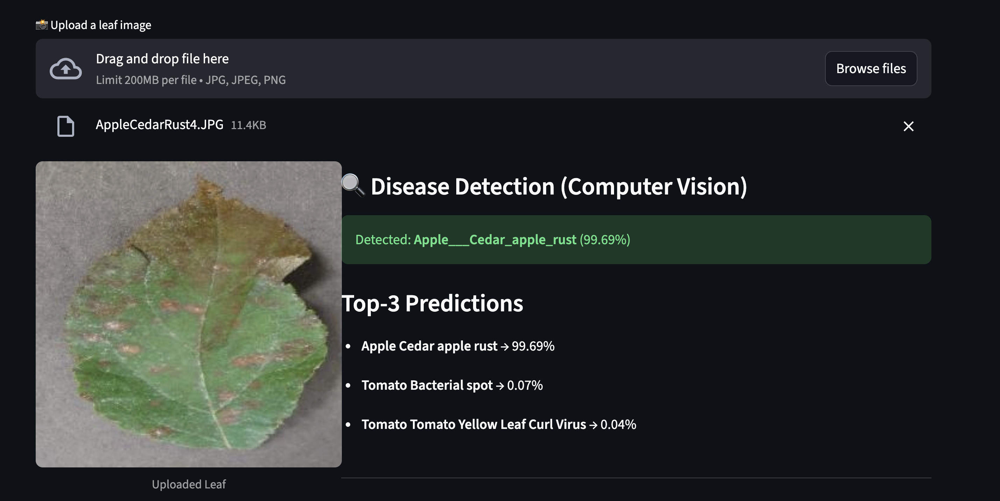
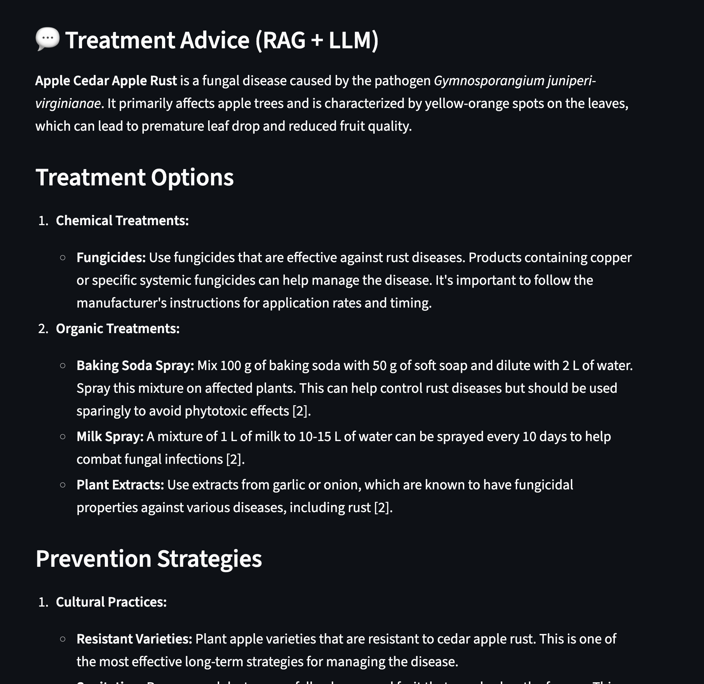
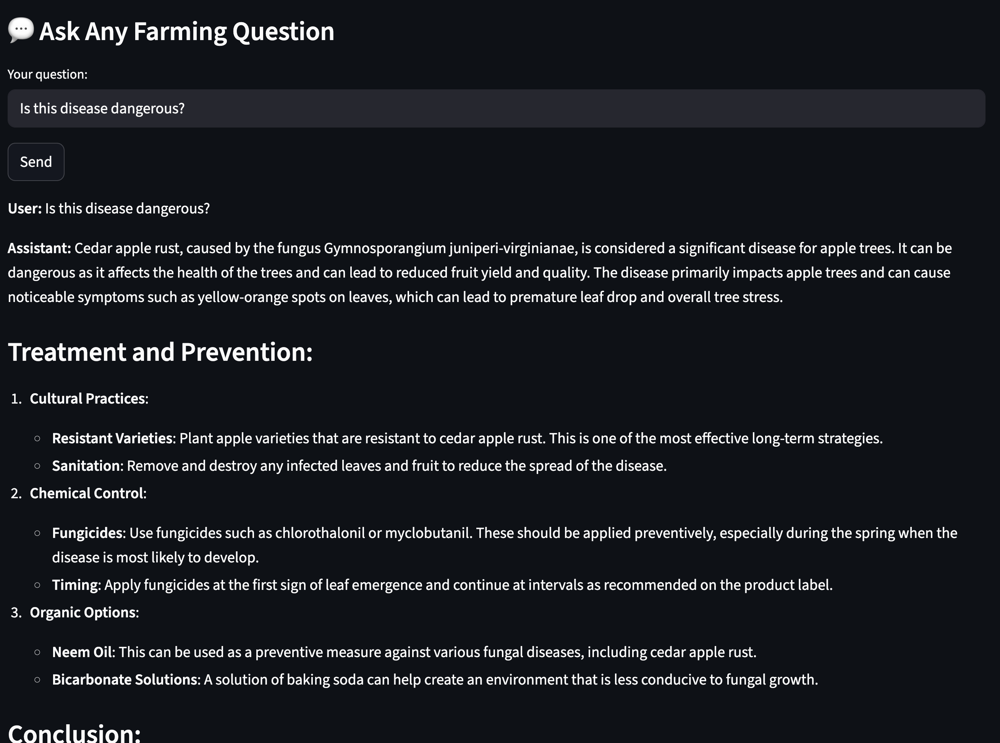

# 🌿 AgriSense AI — Intelligent Agricultural Assistant

An AI-powered crop disease detection and farming knowledge system combining **Computer Vision**, **RAG**, and **Large Language Models** to deliver expert-level agricultural support.

---

# 📸 Screenshots

## **Disease Detection**



## **Treatment Recommendation (RAG + LLM)**



## **Chatbot Interaction**



---

# 📚 Overview

**AgriSense AI** is a multi-modal agricultural assistant that helps farmers diagnose crop diseases from leaf images and receive expert treatment advice powered by a Retrieval-Augmented Generation (RAG) system.

### Core Capabilities

* 🌱 **Leaf Disease Detection** using EfficientNet-B0
* 📚 **RAG-based Knowledge Retrieval** from large agricultural documents
* 🤖 **GPT-4o-mini** for generating treatment advice
* 💬 **Interactive Chatbot** for agricultural queries
* 🧠 **Context-aware suggestions** combining CV + RAG
* 🖥️ **Streamlit-based UI**

---

# 🧩 System Architecture

```mermaid
flowchart LR
    A[Leaf Image Upload] --> B["EfficientNet-B0 Model<br/>Disease Classification"]
    B --> C[Auto Query Generator]
    C --> D["RAG Retriever<br/>ChromaDB + Embeddings"]
    D --> E[LLM (GPT-4o-mini)"]
    E --> F[Final Treatment Advice]
    F --> G[Streamlit UI Output"]
```

---

# 🚀 Features

## 🌿 1. Computer Vision Disease Detection

* EfficientNet-B0 transfer learning
* 23 disease categories
* Top-3 prediction bars
* Auto-generated query for RAG

---

## 📘 2. Retrieval-Augmented Generation (RAG)

* MiniLM sentence embeddings
* ChromaDB vector store
* Document-grounded responses
* Prevention + treatment guidance
* Organic & chemical recommendations

---

## 💬 3. Chatbot

* Ask farming questions naturally
* RAG-enhanced LLM answers
* Chat-like user interface

---

# 🏗️ Tech Stack

### Backend

* Python 3.10
* PyTorch
* SentenceTransformers
* ChromaDB
* OpenAI GPT-4o-mini
* pdfplumber

### Frontend

* Streamlit
* Custom CSS UI

### Models

* EfficientNet-B0
* all-MiniLM-L6-v2 Embeddings

---

# 📁 Project Structure

```
agri-assistant/
│
├── README.md
├── .gitignore
├── requirements.txt
├── .env.example
│
├── data/
│   ├── raw/                  ← keep empty or sample text
│   └── knowledge_base/       ← keep only sample file or empty
│
├── models/
│   ├── disease_model/
│   └── embeddings/
│
├── src/
│   ├── app.py
│   ├── cv_module/
│   │   ├── train.py
│   │   ├── infer.py
│   │   ├── dataset_loader.py
│   │   └── __init__.py
│   ├── rag_module/
│   │   ├── ingest_docs.py
│   │   ├── build_kb.py
│   │   ├── generate.py
│   │   ├── retrieve.py
│   │   ├── utils.py
│   │   └── __init__.py
│   └── __init__.py
│
└── scripts/
    ├── (optional utilities)

```

---

# ⚙️ Installation

### 1. Clone Repository

```bash
git clone https://github.com/sanyamkunwar/agrisense-ai.git
cd agri-assistant
```

### 2. Setup Virtual Environment

```bash
python3 -m venv venv
source venv/bin/activate
```

### 3. Install Dependencies

```bash
pip install -r requirements.txt
```

---

# 🔑 Environment Variables (.env)

```
OPENAI_API_KEY=your_openai_key
OPENAI_MODEL=gpt-4o-mini

CHROMA_DB_DIR=models/embeddings/
KB_PATH=data/knowledge_base/processed_kb.json

CV_MODEL_PATH=models/disease_model/best_model.pth
CV_CLASSES_PATH=models/disease_model/classes.txt
RAW_DATA_DIR=data/raw/plantvillage/combined

EMBED_MODEL=sentence-transformers/all-MiniLM-L6-v2
APP_NAME="Intelligent Agricultural Assistant"
```

---

# 📚 Build Knowledge Base

### 1. Ingest documents

```bash
python src/rag_module/ingest_docs.py
```

### 2. Build vector store

```bash
python src/rag_module/build_kb.py
```

---

# 🤖 Train CV Model (Optional)

```bash
python src/cv_module/train.py
```

---

# ▶️ Run the App

```bash
streamlit run src/app.py
```

Then open:

```
http://localhost:8501
```

---

# 📝 Example Queries

### Disease Treatment

* How to treat Tomato Early Blight?
* Methods to cure Apple Black Rot?

### Soil / Nutrition

* How to increase nitrogen naturally?

### General Farming

* Best irrigation for grapes?

---

# 📈 Performance

| Component         | Score                          |
| ----------------- | ------------------------------ |
| CV Model Accuracy | 99% validation                |
| RAG Retrieval     | High-quality MiniLM embeddings |
| LLM Model         | GPT-4o-mini                    |

---

# 🔮 Future Enhancements

* Grad-CAM heatmaps
* Voice support
* Multilingual interface
* Mobile-friendly model
* Deployment via Docker / FastAPI

---

# 👨‍💻 Author

Sanyam Kunwar