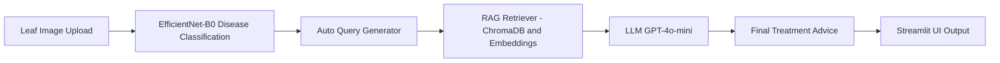

# 🌿 AgriSense AI — Intelligent Agricultural Assistant

An AI-powered crop disease detection and farming knowledge system combining **Computer Vision**, **RAG**, and **Large Language Models** to deliver expert-level agricultural support.

---

# 📸 Screenshots

## **Disease Detection**


## **Treatment Recommendation (RAG + LLM)**


## **Chatbot Interaction**


---

# 📚 Overview

**AgriSense AI** is a multi-modal agricultural assistant that helps farmers diagnose crop diseases from leaf images and receive expert treatment advice powered by a Retrieval-Augmented Generation (RAG) system.

### Core Capabilities

* 🌱 **Leaf Disease Detection** using EfficientNet-B0
* 📚 **RAG-based Knowledge Retrieval** from large agricultural documents
* 🤖 **GPT-4o-mini** for generating treatment advice
* 💬 **Interactive Chatbot** for agricultural queries
* 🧠 **Context-aware suggestions** combining CV + RAG
* 🖥️ **Streamlit-based UI**

---

# 🧩 System Architecture



---

# 🚀 Features

## 🌿 1. Computer Vision Disease Detection

* EfficientNet-B0 transfer learning
* 23 disease categories
* Top-3 prediction bars
* Auto-generated query for RAG

---

## 📘 2. Retrieval-Augmented Generation (RAG)

* MiniLM sentence embeddings
* ChromaDB vector store
* Document-grounded responses
* Prevention + treatment guidance
* Organic & chemical recommendations

---

## 💬 3. Chatbot

* Ask farming questions naturally
* RAG-enhanced LLM answers
* Chat-like user interface

---

# 🏗️ Tech Stack

### Backend

* Python 3.10
* PyTorch
* SentenceTransformers
* ChromaDB
* OpenAI GPT-4o-mini
* pdfplumber

### Frontend

* Streamlit
* Custom CSS UI

### Models

* EfficientNet-B0
* all-MiniLM-L6-v2 Embeddings

---

# 📁 Project Structure

```
agri-assistant/
│
├── README.md
├── .gitignore
├── requirements.txt
├── .env.example
│
├── data/
│   ├── raw/                  ← keep empty or sample text
│   └── knowledge_base/       ← keep only sample file or empty
│
├── models/
│   ├── disease_model/
│   └── embeddings/
│
├── src/
│   ├── app.py
│   ├── cv_module/
│   │   ├── train.py
│   │   ├── infer.py
│   │   ├── dataset_loader.py
│   │   └── __init__.py
│   ├── rag_module/
│   │   ├── ingest_docs.py
│   │   ├── build_kb.py
│   │   ├── generate.py
│   │   ├── retrieve.py
│   │   ├── utils.py
│   │   └── __init__.py
│   └── __init__.py
│
└── scripts/
    ├── (optional utilities)

```

---

# ⚙️ Installation

### 1. Clone Repository

```bash
git clone https://github.com/sanyamkunwar/agrisense-ai.git
cd agri-assistant
```

### 2. Setup Virtual Environment

```bash
python3 -m venv venv
source venv/bin/activate
```

### 3. Install Dependencies

```bash
pip install -r requirements.txt
```

---

# 🧪 Quick Test with Sample Files

This project includes sample files to let you quickly test the application's core features without needing your own data.

### 1. Test Disease Detection (Image Upload)

1.  Run the application:
    ```bash
    streamlit run src/app.py
    ```
2.  Once the app is open in your browser, click the "📸 Upload a leaf image" button.
3.  Navigate to the `sample_files/images/` directory in the file explorer.
4.  Select an image, for example, `TomatoEarlyBlight1.JPG`.
5.  The application will analyze the image, detect the disease, and automatically generate treatment advice using the RAG system.

### 2. Build and Test the RAG Knowledge Base

The chatbot and treatment advice features are powered by a knowledge base built from documents. You can build this using the provided sample documents.

1.  **Configure the Data Source:**
    Open the `.env` file in the root of the project. Find the `RAW_DATA_DIR` variable and change its value to point to the sample documents directory:
    ```env
    # Before
    # RAW_DATA_DIR=data/raw/plantvillage/combined

    # After
    RAW_DATA_DIR=sample_files/documents
    ```

2.  **Build the Knowledge Base:**
    Now, run the ingestion and embedding scripts. These will read the PDFs in the `sample_files/documents` folder and create a vector store for the RAG system.

    *   **Ingest documents:**
        ```bash
        python src/rag_module/ingest_docs.py
        ```
    *   **Build vector store:**
        ```bash
        python src/rag_module/build_kb.py
        ```

3.  **Test the Chatbot:**
    Run the app (`streamlit run src/app.py`) and use the "💬 Ask Any Farming Question" section to ask questions related to the content of the sample documents (e.g., "How to manage tomato diseases?").

**Important:** After testing, you can change the `RAW_DATA_DIR` in your `.env` file back to its original value if you wish to use your own set of documents.

---

# 🔑 Environment Variables (.env)

```
OPENAI_API_KEY=your_openai_key
OPENAI_MODEL=gpt-4o-mini

CHROMA_DB_DIR=models/embeddings/
KB_PATH=data/knowledge_base/processed_kb.json

CV_MODEL_PATH=models/disease_model/best_model.pth
CV_CLASSES_PATH=models/disease_model/classes.txt
RAW_DATA_DIR=data/raw/plantvillage/combined

EMBED_MODEL=sentence-transformers/all-MiniLM-L6-v2
APP_NAME="Intelligent Agricultural Assistant"
```

---

# 📚 Build Knowledge Base

### 1. Ingest documents

```bash
python src/rag_module/ingest_docs.py
```

### 2. Build vector store

```bash
python src/rag_module/build_kb.py
```

---

# 🤖 Train CV Model (Optional)

```bash
python src/cv_module/train.py
```

---

# ▶️ Run the App

```bash
streamlit run src/app.py
```

Then open:

```
http://localhost:8501
```

---

# 🚀 Deployment on Streamlit Cloud

This application is designed to be deployed on [Streamlit Community Cloud](https://streamlit.io/cloud). Follow these steps to deploy your own version.

### 1. Pre-requisites

*   A GitHub account.
*   A Streamlit Community Cloud account (you can sign up for free with your GitHub account).
*   [Git LFS](https://git-lfs.github.com/) installed on your local machine.

### 2. Use Git LFS for Large Model Files

The machine learning models and embeddings are too large to be stored directly in a standard Git repository. We'll use Git LFS to handle them.

1.  **Install Git LFS** (if you haven't already):
    ```bash
    # On macOS
    brew install git-lfs

    # On other systems, see the official installation guide.
    ```

2.  **Set up Git LFS in your repository:**
    Run this command only once for your local repository.
    ```bash
    git lfs install
    ```

3.  **Track Large File Directories:**
    We need to tell Git LFS which files or directories to track. We'll track the entire `models` directory.
    ```bash
    git lfs track "models/**"
    ```
    This command will create a `.gitattributes` file in your repository. Make sure this file is committed.

4.  **Add and Commit the Files:**
    Now, add the `.gitattributes` file and your models to the repository.
    ```bash
    git add .gitattributes
    git add models/
    git commit -m "feat: Track model files with Git LFS"
    ```

5.  **Push to GitHub:**
    Push your project to a new GitHub repository. Git LFS will automatically handle the large files, uploading them to LFS storage.
    ```bash
    git push origin main
    ```

### 3. Deploy on Streamlit Cloud

1.  **Go to Streamlit Cloud:**
    Log in to your Streamlit Cloud account and click the "**New app**" button.

2.  **Configure the App:**
    *   **Repository:** Select the GitHub repository you just pushed.
    *   **Branch:** Select the `main` branch.
    *   **Main file path:** Set this to `src/app.py`.
    *   **App URL:** Choose a custom URL for your app.

3.  **Add Secrets:**
    Your app needs the `OPENAI_API_KEY`.
    *   Click on "**Advanced settings...**".
    *   In the "**Secrets**" section, paste the contents of your local `.env` file. It should look like this:
        ```toml
        OPENAI_API_KEY="your_real_openai_api_key"
        OPENAI_MODEL="gpt-4o-mini"
        # ... and so on for all variables in your .env
        ```
    **Important:** Do NOT commit your `.env` file to GitHub. The secrets manager is the secure way to handle them.

4.  **Deploy!**
    Click the "**Deploy!**" button. Streamlit Cloud will build the environment and launch your application. You can view the logs in real-time.

---

# 📝 Example Queries

### Disease Treatment

* How to treat Tomato Early Blight?
* Methods to cure Apple Black Rot?

### Soil / Nutrition

* How to increase nitrogen naturally?

### General Farming

* Best irrigation for grapes?

---

# 📈 Performance

| Component         | Score                          |
| ----------------- | ------------------------------ |
| CV Model Accuracy | 99% validation                |
| RAG Retrieval     | High-quality MiniLM embeddings |
| LLM Model         | GPT-4o-mini                    |

---

# 🔮 Future Enhancements

* Grad-CAM heatmaps
* Voice support
* Multilingual interface
* Mobile-friendly model
* Deployment via Docker / FastAPI

---

# 👨‍💻 Author

Sanyam Kunwar